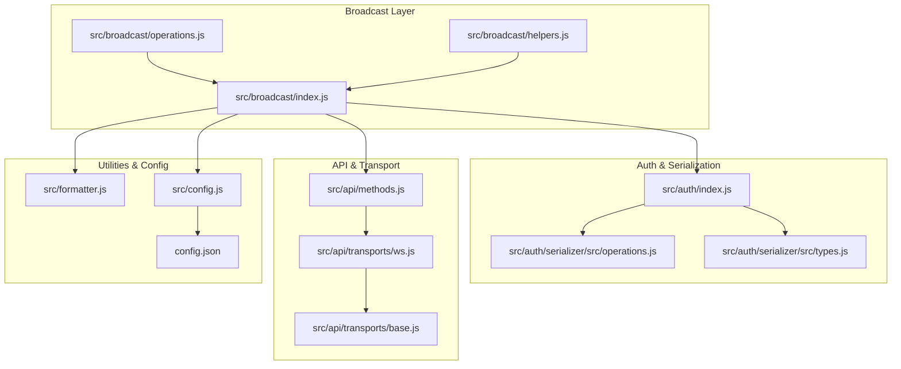
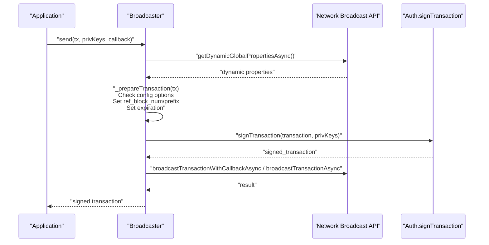
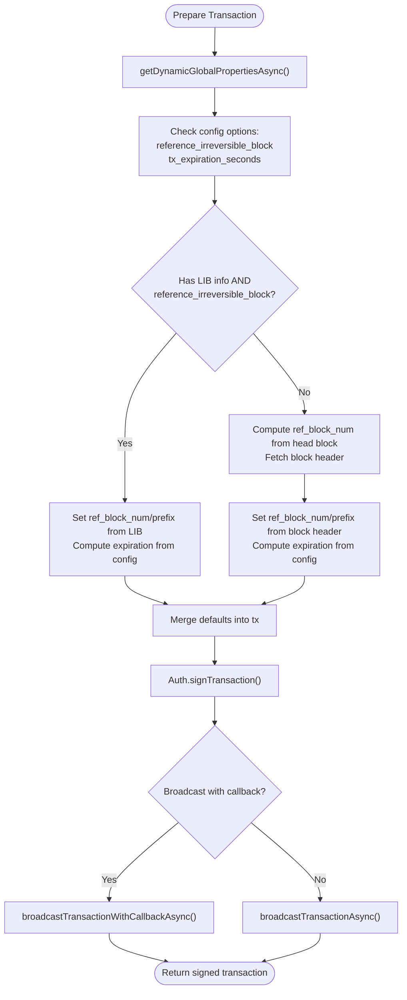
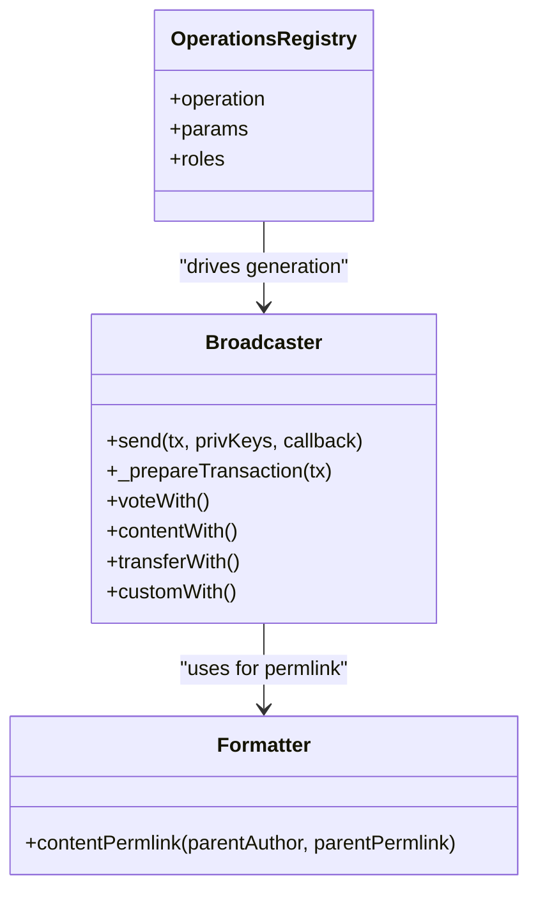
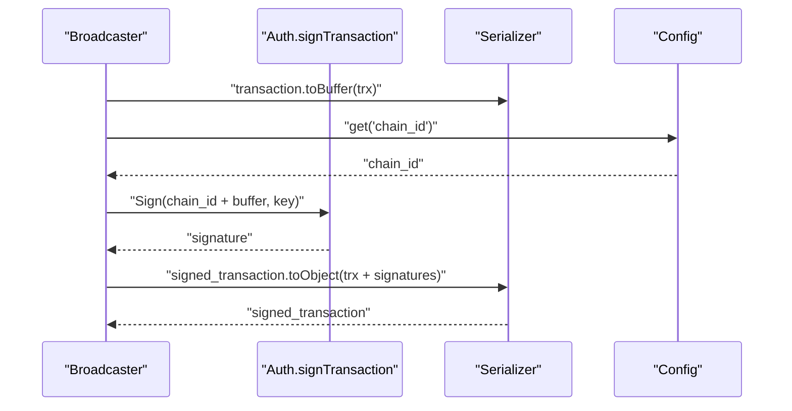
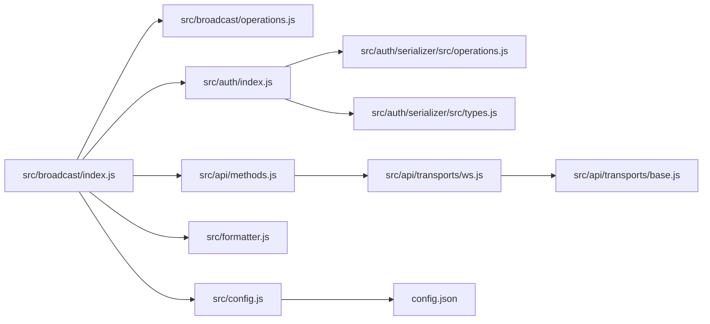

# Broadcast Transactions

<cite>
**Referenced Files in This Document**
- [src/broadcast/index.js](file://src/broadcast/index.js)
- [src/broadcast/operations.js](file://src/broadcast/operations.js)
- [src/broadcast/helpers.js](file://src/broadcast/helpers.js)
- [src/auth/index.js](file://src/auth/index.js)
- [src/auth/serializer/src/operations.js](file://src/auth/serializer/src/operations.js)
- [src/auth/serializer/src/types.js](file://src/auth/serializer/src/types.js)
- [src/api/methods.js](file://src/api/methods.js)
- [src/api/transports/ws.js](file://src/api/transports/ws.js)
- [src/api/transports/base.js](file://src/api/transports/base.js)
- [src/formatter.js](file://src/formatter.js)
- [src/config.js](file://src/config.js)
- [config.json](file://config.json)
- [examples/broadcast.html](file://examples/broadcast.html)
- [test/broadcast.test.js](file://test/broadcast.test.js)
</cite>

## Update Summary
**Changes Made**
- Enhanced transaction preparation with new configuration options for reference block handling
- Added support for configurable transaction expiration times
- Improved reference block selection logic with irreversible block support
- Updated configuration system to support runtime customization of broadcast behavior

## Table of Contents
1. [Introduction](#introduction)
2. [Project Structure](#project-structure)
3. [Core Components](#core-components)
4. [Architecture Overview](#architecture-overview)
5. [Detailed Component Analysis](#detailed-component-analysis)
6. [Configuration Options](#configuration-options)
7. [Dependency Analysis](#dependency-analysis)
8. [Performance Considerations](#performance-considerations)
9. [Troubleshooting Guide](#troubleshooting-guide)
10. [Conclusion](#conclusion)
11. [Appendices](#appendices)

## Introduction
This document explains the transaction broadcasting functionality in the VIZ JavaScript library. It covers the broadcast system architecture, operation construction, transaction signing, and network submission. It documents supported operation types (including transfers, votes, comments, and custom JSON), transaction building blocks, fee calculation, expiration handling, and broadcast verification. Practical examples, error handling strategies, debugging techniques, batch operations, transaction simulation, and integration with the authentication system are included.

**Updated** Enhanced with new configuration options for reference block handling and transaction expiration control, providing improved flexibility for different network conditions and use cases.

## Project Structure
The broadcast subsystem is composed of:
- Broadcast orchestrator that prepares, signs, and submits transactions
- Operation registry enumerating supported operations and their parameters
- Authentication module handling cryptographic signing
- API transport layer for network communication
- Formatter utilities for common tasks like permlink generation
- Configuration system for chain ID, address prefix, broadcast mode, and advanced options



**Diagram sources**
- [src/broadcast/index.js:1-146](file://src/broadcast/index.js#L1-L146)
- [src/broadcast/operations.js:1-475](file://src/broadcast/operations.js#L1-L475)
- [src/broadcast/helpers.js:1-82](file://src/broadcast/helpers.js#L1-L82)
- [src/auth/index.js:1-133](file://src/auth/index.js#L1-L133)
- [src/auth/serializer/src/operations.js:73-125](file://src/auth/serializer/src/operations.js#L73-L125)
- [src/auth/serializer/src/types.js:30-69](file://src/auth/serializer/src/types.js#L30-L69)
- [src/api/methods.js:356-374](file://src/api/methods.js#L356-L374)
- [src/api/transports/ws.js:1-136](file://src/api/transports/ws.js#L1-L136)
- [src/api/transports/base.js:1-34](file://src/api/transports/base.js#L1-L34)
- [src/formatter.js:69-76](file://src/formatter.js#L69-L76)
- [src/config.js:1-10](file://src/config.js#L1-L10)
- [config.json:1-9](file://config.json#L1-L9)

**Section sources**
- [src/broadcast/index.js:1-146](file://src/broadcast/index.js#L1-L146)
- [src/broadcast/operations.js:1-475](file://src/broadcast/operations.js#L1-L475)
- [src/broadcast/helpers.js:1-82](file://src/broadcast/helpers.js#L1-L82)
- [src/auth/index.js:1-133](file://src/auth/index.js#L1-L133)
- [src/auth/serializer/src/operations.js:73-125](file://src/auth/serializer/src/operations.js#L73-L125)
- [src/auth/serializer/src/types.js:30-69](file://src/auth/serializer/src/types.js#L30-L69)
- [src/api/methods.js:356-374](file://src/api/methods.js#L356-L374)
- [src/api/transports/ws.js:1-136](file://src/api/transports/ws.js#L1-L136)
- [src/api/transports/base.js:1-34](file://src/api/transports/base.js#L1-L34)
- [src/formatter.js:69-76](file://src/formatter.js#L69-L76)
- [src/config.js:1-10](file://src/config.js#L1-L10)
- [config.json:1-9](file://config.json#L1-L9)

## Core Components
- Broadcaster: Orchestrates transaction preparation, signing, and submission. It fetches dynamic global properties, sets reference block and expiration based on configuration, signs with private keys, and broadcasts via network broadcast API.
- Operations registry: Declares supported operations, parameter lists, and required roles for each operation.
- Authentication: Provides signing functions, key derivation, and WIF utilities.
- API methods: Exposes network broadcast APIs and other endpoints used by the broadcaster.
- Transport: WebSocket transport for API communication with connection lifecycle and error handling.
- Formatter: Utility functions for common tasks such as generating permlinks for comments.
- Config: Centralized configuration including chain ID, address prefix, broadcast mode, and advanced options for reference block handling and transaction expiration.

**Updated** Enhanced configuration system now supports runtime customization of reference block behavior and transaction expiration timing.

**Section sources**
- [src/broadcast/index.js:24-84](file://src/broadcast/index.js#L24-L84)
- [src/broadcast/operations.js:1-475](file://src/broadcast/operations.js#L1-L475)
- [src/auth/index.js:107-130](file://src/auth/index.js#L107-L130)
- [src/api/methods.js:356-374](file://src/api/methods.js#L356-L374)
- [src/api/transports/ws.js:27-94](file://src/api/transports/ws.js#L27-L94)
- [src/formatter.js:69-76](file://src/formatter.js#L69-L76)
- [src/config.js:1-10](file://src/config.js#L1-L10)
- [config.json:1-9](file://config.json#L1-L9)

## Architecture Overview
End-to-end flow for broadcasting a transaction:
1. Prepare transaction: Fetch dynamic global properties, compute reference block and expiration based on configuration.
2. Sign transaction: Compute chain ID concatenated with serialized transaction buffer; sign with provided private keys.
3. Submit transaction: Choose broadcast method based on configuration; submit to network broadcast API.



**Diagram sources**
- [src/broadcast/index.js:24-47](file://src/broadcast/index.js#L24-L47)
- [src/broadcast/index.js:49-84](file://src/broadcast/index.js#L49-L84)
- [src/auth/index.js:107-130](file://src/auth/index.js#L107-L130)
- [src/api/methods.js:356-374](file://src/api/methods.js#L356-L374)

## Detailed Component Analysis

### Transaction Preparation and Submission
- Dynamic properties: Retrieves chain time and last irreversible block reference to compute expiration and reference fields.
- Reference block selection: Uses last irreversible block if available and configured; otherwise derives from head block number and block header.
- Expiration: Adds configurable offset to chain time to ensure reasonable validity window.
- Broadcasting modes: Supports synchronous and callback-based broadcast depending on configuration.

**Updated** Enhanced with configurable reference block handling and transaction expiration control.



**Diagram sources**
- [src/broadcast/index.js:49-93](file://src/broadcast/index.js#L49-L93)
- [src/auth/index.js:107-130](file://src/auth/index.js#L107-L130)
- [src/api/methods.js:356-374](file://src/api/methods.js#L356-L374)

**Section sources**
- [src/broadcast/index.js:49-93](file://src/broadcast/index.js#L49-L93)
- [src/config.js:1-10](file://src/config.js#L1-L10)
- [config.json:6-8](file://config.json#L6-L8)

### Operation Construction and Generation
- Operation registry defines supported operations, parameter names, and required roles.
- Broadcaster dynamically generates convenience methods for each operation, mapping parameters to operation objects.
- Specialized helpers handle metadata serialization and permlink generation for comments.



**Diagram sources**
- [src/broadcast/operations.js:1-475](file://src/broadcast/operations.js#L1-L475)
- [src/broadcast/index.js:89-129](file://src/broadcast/index.js#L89-L129)
- [src/formatter.js:69-76](file://src/formatter.js#L69-L76)

**Section sources**
- [src/broadcast/operations.js:1-475](file://src/broadcast/operations.js#L1-L475)
- [src/broadcast/index.js:89-129](file://src/broadcast/index.js#L89-L129)
- [src/formatter.js:69-76](file://src/formatter.js#L69-L76)

### Signing and Serialization
- Transaction serialization: Uses generated serializers for transaction and signed_transaction structures.
- Chain ID concatenation: Signs chain_id + digest of serialized transaction buffer.
- Signature aggregation: Collects signatures per provided private key and returns a signed transaction object.



**Diagram sources**
- [src/auth/index.js:107-130](file://src/auth/index.js#L107-L130)
- [src/auth/serializer/src/operations.js:73-125](file://src/auth/serializer/src/operations.js#L73-L125)
- [src/config.js:5-6](file://src/config.js#L5-L6)
- [config.json:4-4](file://config.json#L4-L4)

**Section sources**
- [src/auth/index.js:107-130](file://src/auth/index.js#L107-L130)
- [src/auth/serializer/src/operations.js:73-125](file://src/auth/serializer/src/operations.js#L73-L125)
- [src/auth/serializer/src/types.js:30-69](file://src/auth/serializer/src/types.js#L30-L69)

### Supported Operations and Examples
Common operations and their typical usage:
- Vote: Cast or update a vote on content.
- Content: Create or edit a post/comment.
- Transfer: Move tokens between accounts.
- Custom: Execute custom JSON operations with required authorities.

Examples are provided in the example page and tests demonstrating usage patterns and callback handling.

**Section sources**
- [src/broadcast/operations.js:2-36](file://src/broadcast/operations.js#L2-L36)
- [examples/broadcast.html:15-25](file://examples/broadcast.html#L15-L25)
- [examples/broadcast.html:27-60](file://examples/broadcast.html#L27-L60)
- [examples/broadcast.html:74-83](file://examples/broadcast.html#L74-L83)
- [test/broadcast.test.js:16-31](file://test/broadcast.test.js#L16-L31)
- [test/broadcast.test.js:80-97](file://test/broadcast.test.js#L80-L97)
- [test/broadcast.test.js:127-141](file://test/broadcast.test.js#L127-L141)

### Authority Management Helpers
- Add/remove account authorizations for delegated posting or active permissions.
- Updates account authority structures and triggers an account update transaction.

**Section sources**
- [src/broadcast/helpers.js:6-80](file://src/broadcast/helpers.js#L6-L80)

### Network Transport and API Methods
- WebSocket transport manages connection lifecycle, request queuing, and response/error handling.
- API methods expose network broadcast endpoints used by the broadcaster.

**Section sources**
- [src/api/transports/ws.js:27-94](file://src/api/transports/ws.js#L27-L94)
- [src/api/methods.js:356-374](file://src/api/methods.js#L356-L374)

## Configuration Options

The VIZ JavaScript broadcast system now supports advanced configuration options for fine-tuning transaction behavior:

### Reference Block Configuration
- `reference_irreversible_block`: Boolean flag controlling whether to use the last irreversible block (LIB) as the reference block
- When enabled: Uses `last_irreversible_block_ref_num` and `last_irreversible_block_ref_prefix` from dynamic properties
- When disabled: Falls back to head block reference using `head_block_number` and `head_block_id`

### Transaction Expiration Configuration
- `tx_expiration_seconds`: Configurable expiration time in seconds (defaults to 60 if not specified)
- Controls how long transactions remain valid after creation
- Can be adjusted based on network conditions and application requirements

### Configuration Usage Examples

```javascript
// Enable irreversible block references and custom expiration
viz.config.set('reference_irreversible_block', true);
viz.config.set('tx_expiration_seconds', 120); // 2 minutes

// Disable irreversible block references (default behavior)
viz.config.set('reference_irreversible_block', false);

// Set custom expiration time
viz.config.set('tx_expiration_seconds', 300); // 5 minutes
```

**New Section** Added comprehensive documentation for the new configuration system that enhances broadcast transaction functionality.

**Section sources**
- [src/broadcast/index.js:55-67](file://src/broadcast/index.js#L55-L67)
- [src/config.js:1-10](file://src/config.js#L1-L10)
- [config.json:6-8](file://config.json#L6-L8)

## Dependency Analysis
High-level dependencies among broadcast components:



**Diagram sources**
- [src/broadcast/index.js:1-11](file://src/broadcast/index.js#L1-L11)
- [src/broadcast/operations.js:1-10](file://src/broadcast/operations.js#L1-L10)
- [src/auth/index.js:1-11](file://src/auth/index.js#L1-L11)
- [src/auth/serializer/src/operations.js:20-52](file://src/auth/serializer/src/operations.js#L20-L52)
- [src/auth/serializer/src/types.js:10-14](file://src/auth/serializer/src/types.js#L10-L14)
- [src/api/methods.js:1-10](file://src/api/methods.js#L1-L10)
- [src/api/transports/ws.js:1-14](file://src/api/transports/ws.js#L1-L14)
- [src/api/transports/base.js:1-9](file://src/api/transports/base.js#L1-L9)
- [src/config.js:1-10](file://src/config.js#L1-L10)
- [config.json:1-9](file://config.json#L1-L9)

**Section sources**
- [src/broadcast/index.js:1-11](file://src/broadcast/index.js#L1-L11)
- [src/auth/index.js:1-11](file://src/auth/index.js#L1-L11)
- [src/auth/serializer/src/operations.js:20-52](file://src/auth/serializer/src/operations.js#L20-L52)
- [src/auth/serializer/src/types.js:10-14](file://src/auth/serializer/src/types.js#L10-L14)
- [src/api/methods.js:1-10](file://src/api/methods.js#L1-L10)
- [src/api/transports/ws.js:1-14](file://src/api/transports/ws.js#L1-L14)
- [src/api/transports/base.js:1-9](file://src/api/transports/base.js#L1-L9)
- [src/config.js:1-10](file://src/config.js#L1-L10)
- [config.json:1-9](file://config.json#L1-L9)

## Performance Considerations
- Transaction validity window: Expiration is set to configurable offset; ensure clock synchronization to avoid premature expiration.
- Reference block freshness: Using last irreversible block improves finality guarantees; fallback to head block requires careful handling of reorg risks.
- Batch operations: Group multiple operations into a single transaction to reduce fees and latency.
- Simulation: Use potential/signature verification APIs to estimate required keys and validate transactions before submission.
- Network optimization: Configurable reference block selection allows adaptation to different network conditions and latency requirements.

**Updated** Enhanced performance considerations now include configurable reference block handling and transaction expiration optimization.

## Troubleshooting Guide
- Transaction rejected due to expiration: Verify dynamic properties retrieval and local time alignment; adjust `tx_expiration_seconds` as needed.
- Invalid reference block: Confirm head block and LIB availability; handle fallback logic based on `reference_irreversible_block` setting.
- Missing signatures: Ensure correct private keys are provided and chain ID matches the network.
- WebSocket connectivity: Inspect transport error handling and reconnection behavior.
- Authority issues: Use helper methods to add/remove delegated authorizations and verify account authority structures.
- Configuration issues: Verify that configuration options are properly set and accessible via the config system.

**Updated** Added troubleshooting guidance for the new configuration options and their impact on transaction behavior.

**Section sources**
- [src/broadcast/index.js:49-93](file://src/broadcast/index.js#L49-L93)
- [src/api/transports/ws.js:96-134](file://src/api/transports/ws.js#L96-L134)
- [src/broadcast/helpers.js:6-80](file://src/broadcast/helpers.js#L6-L80)
- [test/broadcast.test.js:33-52](file://test/broadcast.test.js#L33-L52)

## Conclusion
The VIZ JavaScript broadcast system provides a robust, modular pipeline for constructing, signing, and submitting transactions. It supports a wide range of operations, integrates tightly with the authentication and serialization layers, and offers flexible transport and configuration options. The enhanced configuration system now provides fine-grained control over reference block handling and transaction expiration, enabling reliable transaction broadcasting across diverse applications and network conditions.

**Updated** Enhanced conclusion reflects the new configuration capabilities that improve the system's flexibility and adaptability to different use cases.

## Appendices

### Practical Examples Index
- Voting: [examples/broadcast.html:15-25](file://examples/broadcast.html#L15-L25)
- Comment creation: [examples/broadcast.html:27-60](file://examples/broadcast.html#L27-L60)
- Post creation: [examples/broadcast.html:44-60](file://examples/broadcast.html#L44-L60)
- Custom JSON: [examples/broadcast.html:74-83](file://examples/broadcast.html#L74-L83)

### Testing References
- Generated methods existence: [test/broadcast.test.js:16-31](file://test/broadcast.test.js#L16-L31)
- Transaction preparation: [test/broadcast.test.js:33-52](file://test/broadcast.test.js#L33-L52)
- Downvote and vote flows: [test/broadcast.test.js:54-120](file://test/broadcast.test.js#L54-L120)
- Custom JSON flow: [test/broadcast.test.js:122-152](file://test/broadcast.test.js#L122-L152)

### Configuration Examples
- Enabling irreversible block references: [config.json:6-6](file://config.json#L6-L6)
- Setting custom expiration: [config.json:7-7](file://config.json#L7-L7)
- Runtime configuration updates: [src/broadcast/index.js:55-57](file://src/broadcast/index.js#L55-L57)

**New Section** Added configuration examples and references for the new broadcast options.